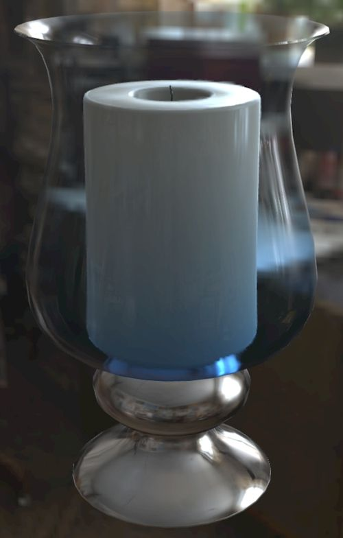

# Adding Material Extensions to glTF Models #

By Eric Chadwick, Staff Technical Artist, Wayfair, [@echadwick-wayfair](https://github.com/echadwick-wayfair)

This tutorial explains how to edit glTF files using open source software to add material extensions [KHR_materials_transmission](https://github.com/KhronosGroup/glTF/blob/master/extensions/2.0/Khronos/KHR_materials_transmission/README.md) and [KHR_materials_volume](https://github.com/KhronosGroup/glTF/blob/master/extensions/2.0/Khronos/KHR_materials_volume/README.md) to create glass with reflection, refraction, and absorption. 

These methods can be repurposed for [other material extensions](https://github.com/KhronosGroup/glTF/tree/main/extensions#gltf-extension-registry) too.

_(Above) glTF glass vase with transmission and volume_

* [Why add Extensions?](AddingMaterialExtensions_001_WhyAddExtensions.md)
* [Using Visual Studio Code](AddingMaterialExtensions_002_UsingVisualStudioCode.md)
* [KHR_materials_transmission and KHR_materials_volume](AddingMaterialExtensions_003_TransmissionAndVolume.md)
* [Using a Raytracer](AddingMaterialExtensions_004_UsingARaytracer.md)
* [Transmission Limitations](AddingMaterialExtensions_005_TransmissionLimitations.md)

**Acknowledgements:**

- Alexey Knyazev, [@lexaknyazev](https://github.com/lexaknyazev)
- Emmett Lalish, [@elalish](https://github.com/elalish)